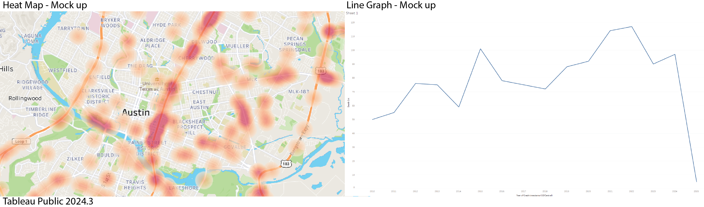
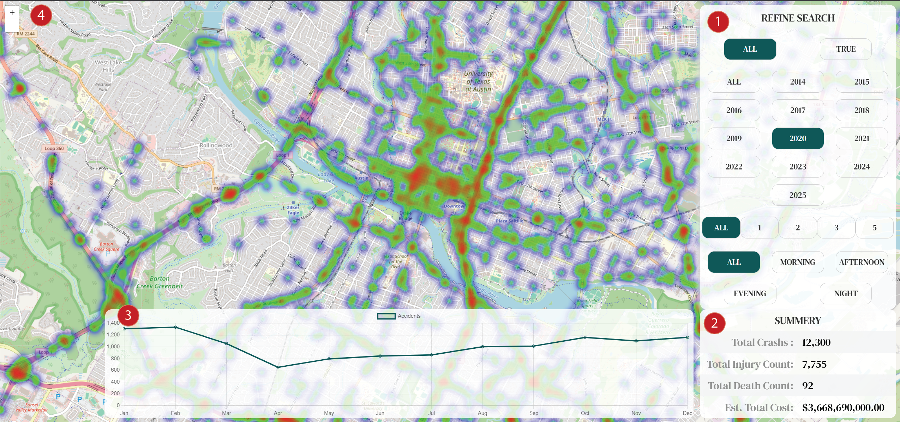

# Visualization of Vehicle Accidents in the U.S. (Austin Focus)

| Deployed App | [Texas Heat Viz](https://data-vis-austin-crash-report.onrender.com/) |
|--|--|
| Author | [Sergio Rojas-Aguilar](https://github.com/Sergrojas29/NoSLQ-Social-Network-API/edit/main/README.md) |
| Data Provided by | [austintexas.gov](https://data.austintexas.gov/Transportation-and-Mobility/Austin-Crash-Report-Data-Crash-Level-Records/y2wy-tgr5/about_data) |
| Dataset Owner | [transportation.data@austintexas.gov](mailto:transportation.data@austintexas.gov) |

| Chapter | Link |
|--|--|
| 1 | [Introduction](#introduction) |
| 2 | [Dataset](#dataset) |
| 3 | [Tasks](#tasks) |
| 4 | [Visual Design](#visual-design) |
| 5 | [Results](#results) |
| 6 | [Diagrams](#diagrams) |
| 7 | [Demo](#demo) |
| 8 | [Data Description](#data-description) |

<div style="page-break-after: always;"></div>


# Introduction

Vehicle accidents are a major concern in the U.S., impacting legislation, road safety, engineering standards, and car software systems. Texas, in particular, ranks highest for dangerous roads, with its four largest cities — Austin, Dallas, Houston, and San Antonio — contributing heavily to accident rates. Austin, though the safest among these, still presents significant safety challenges.

Understanding patterns of accidents through visualization can lead to critical societal changes, from adjusting speed limits to designing safer roads. A visualization of the massive and complex datasets enables lawmakers, urban planners, law enforcement, and citizens to intuitively explore patterns and make data-driven decisions. It also helps communicate findings clearly for debates around road safety topics, such as dangerous roads, time-of-day frequency, and even year-to-year changes.

# Dataset

For this project, the primary dataset focuses on **vehicle accidents within the city of Austin**. While initial plans included national data (e.g., NHTSA's FARS dataset), the decision was made to focus locally due to Austin’s personal relevance and Texas' broader reputation for dangerous roads.

### Source:

- Austin Crash Data from local government sources.
  * **217K Rows**
  * **45 Columns**
  * *Data Last Updated April 26, 2025*
  * *Date Created July 30, 2019*
- Possible additional data from Texas Department of Transportation or Austin's city APIs.

### Data Cleaning & Quality Considerations:

- Handle missing values (e.g., Geo-location data, case_ID).
- Correct font errors and misspellings (noted mainly in the header `units_involved`).
- Standardize inconsistent data formats and handle -1 as null values for speed limits.
- Header corrections to assist parsing later.
- Remove unused columns to reduce file size and search times.
- Simplify dates for easier computation (e.g., splitting `1/8/2014 1:35:00 PM` into separate columns).

### Data Types and Abstractions:
- Nominal (Categorical): Crash Fatal Flag, Crash Severity ID, Units Involved.
- Quantitative (Numerical): Crash Speed Limit, Death Count.
- Spatial: Latitude and Longitude for crash locations.
- Temporal: Time attributes exist but are not shown in the sample.


<div style="page-break-after: always;"></div>

### Dataset Structure Example:

| crash_fatal_fl | crash_speed_limit | latitude | longitude | crash_sev_id | death_cnt | units_involved |
|--|--|--|--|--|--|--|
| FALSE | 60 | 30.22162487 | -97.67515804 | 5 | 0 | Passenger car |
| TRUE | 40 | 30.25331478 | -97.69759248 | 5 | 1 | Passenger car |

[Full Data Example](#data-description) : Includes detailed description.

### Potential Issues:
- Large file sizes (~400MB+) may exceed free hosting service limits (e.g., Render.com).

```javascript
export default defineConfig({
  plugins: [react()],
  build: {
    target: 'esnext', // allow top-level async
    chunkSizeWarningLimit: 4500, // larger file size allowance
  },
})
```

- May need hybrid solutions: static crash data + dynamic API-based weather data retrieval.
- React re-render times with large datasets.


# Tasks

### Domain Goals:
1. **Identify High-Risk Areas**: Find and visualize accident-prone areas in Austin.
2. **Analyze Temporal Patterns**: Understand trends across different time periods (peak hours, seasons).
3. **Assess Contributing Factors**: Explore relationships between accidents and weather, road conditions, and speed limits.
4. **Compare Across Locations**: (Future implementation) Compare Austin to other cities (like Dallas) for broader insights.

### Task Abstraction:
- **Find**: Locate high-incident crash zones.
- **Compare**: Crash severity across speed limits and weather conditions.
- **Summarize**: Aggregate crashes by severity, fatality, and unit type.
- **Drill-Down**: Filter by crash attributes, neighborhoods, or time periods.

<div style="page-break-after: always;"></div>

# Visual Design

### Initial and Final Visualization Ideas:
- **Heatmaps**:
  - General crash density by latitude/longitude.
  - Fatal crashes density refinement.
- **Line Charts**:
  - Plot the number of accidents by month (segmented by year, severity, fatality, time of day).

**Tableau Initial Mock-up**  




### Interactive Features:
- **Filtering by**:
  - Crash severity
  - Year occurred
  - Was it fatal
  - Time of day
- Hover tooltips showing detailed crash information.
- Drill-down to focus on specific Austin neighborhoods (zoom in on the map responsibly).


<div style="page-break-after: always;"></div>

### Technical Stack:
- **Data Handling**: PapaParse library for efficient CSV parsing.
- **Visualization Tools**: Tableau (prototyping), ChartJS, Leaflet.
- **Development Environment**: TypeScript, React Framework.
- **Hosting**: Render.com (noting storage and file-size challenges).





<div style="page-break-after: always;"></div>

# Results

The system is designed to perform essential tasks such as identifying accident hotspots, analyzing accident severity by time of day and year, and providing city officials and citizens with actionable insights. The core use case revolves around an interactive map and dashboard where:
1. Users explore Austin accident data visually through heatmaps and charts.
2. Get a summary of selected data and knowledge of active data size.
3. Users can generate insights and recommendations for safer city planning or public awareness campaigns.
4. Final deployment aims to be a hosted, accessible site showing real-time or periodically updated crash information.

<div style="page-break-after: always;"></div>

# Demonstration




| Callout # | Label | Function | Description |
|--|--|--|--|
| 1 | Refine Search | Filter dataset based on selection | By Fatal Boolean Value, By Year, Crash Severity, Time of Day |
| 2 | Summary | Reduction of current filtered dataset | Live update to show total crashes, injury count, death count, and compensation value |
| 3 | Line Chart | View current dataset based on month | Live update of total accidents tracked by month |
| 4 | Heat Map | Heat map of all accidents based on current dataset | Live update of accident locations based on proximity to one another |

**Note on filter for Crash Severity:**
- 1 = INCAPACITATING INJURY
- 2 = NON-INCAPACITATING INJURY
- 3 = POSSIBLE INJURY
- 4 = KILLED
- 5 = NOT INJURED

Since there is an error if the user filters for **FATAL: TRUE** and **Crash Severity: 5**, it would cause an empty dataset. Inherently, if there is a fatal accident, someone must have been hurt.

**Correction**: In this case, the system resets the Fatal boolean value if Crash Severity is changed while Fatal is set to True. It also removes Severity Value 4 when Fatal is selected, as it would be redundant.


<div style="page-break-after: always;"></div>

# Data Description

| ID | Description | API Field Name | Data Type |
|---|---|---|---|
| Crash ID | TxDOT C.R.I.S. system-generated unique identifying number for a crash | cris_crash_id | Number |
| crash_speed_limit | Speed Limit | crash_speed_limit | Number |
| crash_fatal_fl | Fatal Crash Identifier – Indicates that the crash involved one or more fatalities | crash_fatal_fl | Boolean |
| latitude | Derived latitude map coordinate of the crash | latitude | Number |
| longitude | Derived longitude map coordinate of the crash | longitude | Number |
| crash_sev_id | Crash Severity – Most severe injury suffered by any one person involved in the crash (0 = UNKNOWN, 1 = INCAPACITATING INJURY, etc.) | crash_sev_id | Number |
| tot_injry_cnt | Total Injury Count | tot_injry_cnt | Number |
| death_cnt | Total Death Count | death_cnt | Number |
| units_involved | Mode of units involved in crash | units_involved | Text |
| onsys_fl | Flag indicating whether the primary road of crash was on the TxDOT highway system | onsys_fl | Boolean |
| Crash timestamp (US/Central) | Timestamp at which the crash occurred (US/Central time) | crash_timestamp_ct | Floating Timestamp |
| Crash timestamp | Timestamp at which the crash occurred (UTC time) | crash_timestamp | Floating Timestamp |
| Estimated Maximum Comprehensive Cost | Economic and quality of life costs associated with the highest injury severity sustained in the crash | est_comp_cost_crash_based | Number |
| Estimated Total Comprehensive Cost | Economic and quality of life costs associated with all injuries sustained in the crash | est_total_person_comp_cost | Number |


